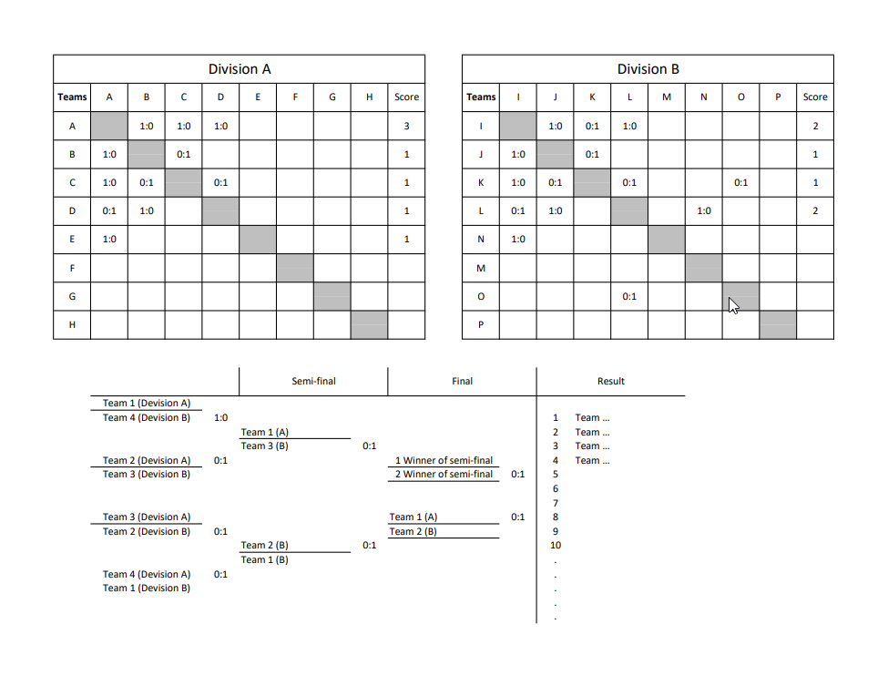

# Standings

## Task
Generate a standings, where the teams are divided into 2 divisions A and B. In each division, the teams play with each other and as a result, 4 best teams from each division go to the playoffs. The playoffs are scheduled according to herringbone principle: the best team plays against the weakest, where the winner takes the lead, and the loser is eliminated from further participation. As a result, the team that wins all playoff games wins.




## Install

Preconditions:
- install locally php8
- install composer


 ````
    composer install
 ````
Set up a database connection in the .env file

 ````
    php artisan migrate
    php artisan serve
 ````
 
